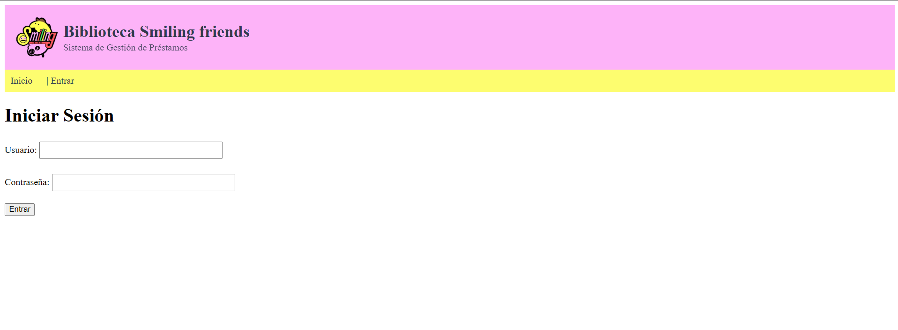
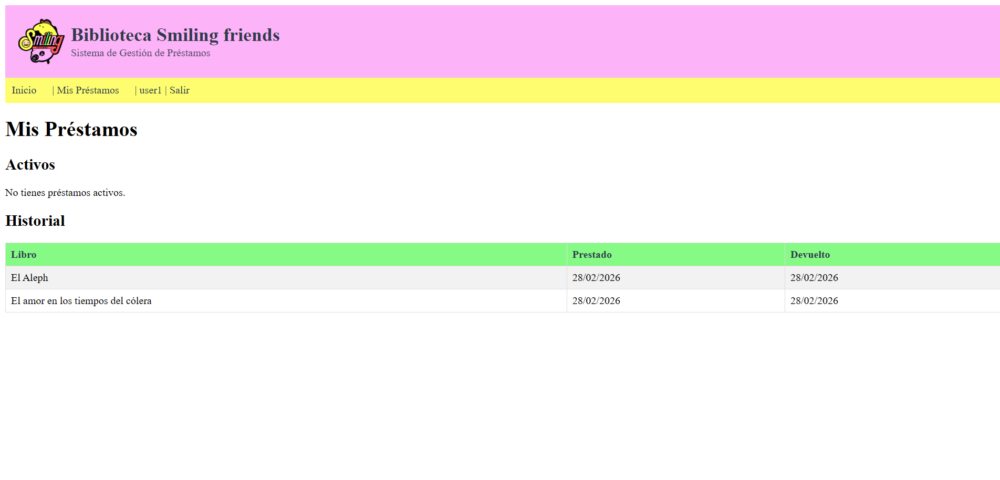
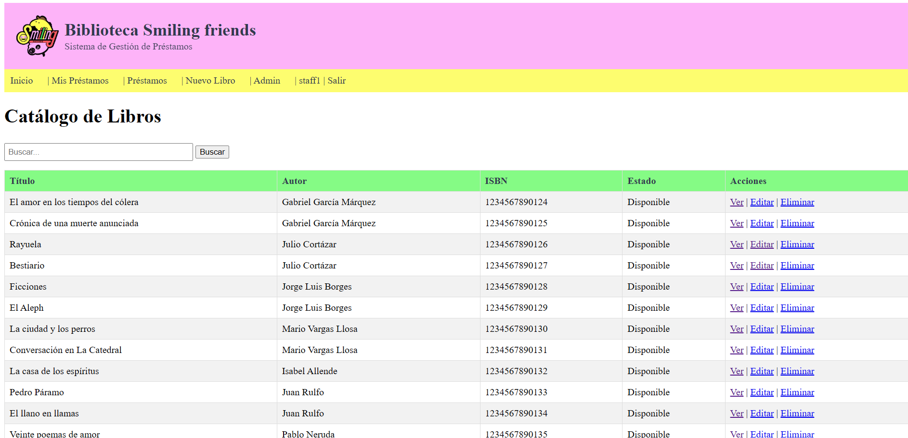
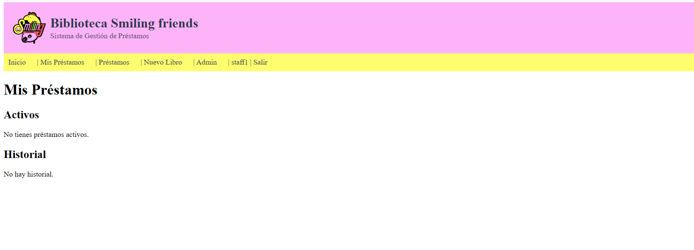
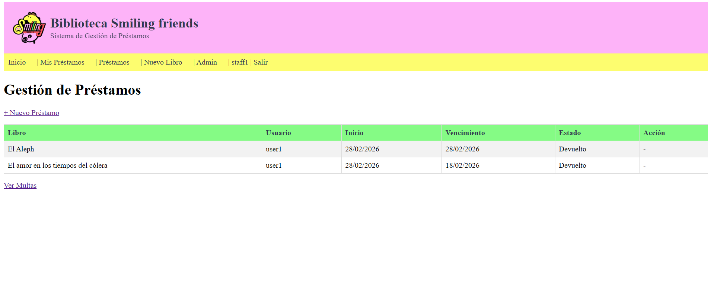
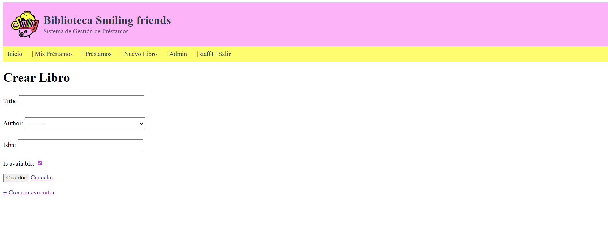

# 📚 Sistema de Biblioteca — Django

Proyecto integrador desarrollado en **Django** para la gestión completa de una biblioteca: catálogo de libros, control de préstamos, devoluciones, multas automáticas y gestión de usuarios con roles.

---

## 🚀 Características principales

- 📖 **Catálogo público**: listado y búsqueda de libros por título o autor  
- 🔐 **Control de roles**: visitantes, usuarios autenticados y staff  
- 🛠 **CRUD completo**: gestión de libros y autores (solo staff)  
- 🔄 **Sistema de préstamos**: control de disponibilidad, préstamos y devoluciones  
- 💰 **Multas automáticas**: cálculo por retraso en devolución  
- 🧪 **Pruebas automatizadas**: cobertura completa del sistema  
- 🛡 **Panel administrativo**: configuración avanzada del admin de Django  

---

## 🧰 Tecnologías

- **Backend:** Django 4.2+  
- **Base de datos:** SQLite (por defecto)  
- **Frontend:** HTML + CSS (templates con herencia)  

---

## ⚙ Instalación

### 1️⃣ Clonar o descomprimir el proyecto

```bash
cd biblioteca
```

### 2️⃣ Crear entorno virtual (recomendado)
```bash
python -m venv venv
```

### Activar entorno:
```bash
Windows:
venv\Scripts\activate

Linux / Mac:
source venv/bin/activate
```

### 3️⃣ Instalar dependencias
```bash
pip install -r requirements.txt
```

### 4️⃣ Aplicar migraciones
```bash
python manage.py makemigrations
python manage.py migrate
```
### 5️⃣ Crear superusuario
```bash
python manage.py createsuperuser
```
### 6️⃣ (Opcional) Cargar datos de prueba
```bash
python manage.py seed_data
```
Se crearán:

Usuarios

staff / staff123 → Usuario staff

usuario / usuario123 → Usuario normal

Datos

14 libros con sus respectivos autores

### 7️⃣ Iniciar servidor
```bash
python manage.py runserver
```
Abrir navegador en:
http://127.0.0.1:8000/

### 👤 Uso del sistema
Roles de usuario
Rol	Permisos
Visitante	Ver catálogo, buscar libros, ver detalles
Usuario	Todo lo anterior + "Mis préstamos"
Staff	Todo lo anterior + CRUD libros, gestión de préstamos y multas
### 🖼 Capturas del sistema
#### 👀 Visitante


#### 👤 Usuario
<p align="center">
    
    
</p>

#### 🛠 Staff
<p align="center">
    
    
</p>

<p align="center">
    
    
</p>

### 🔁 Flujo de préstamo (como staff)

Ir a "Préstamos" → "Nuevo Préstamo"

Seleccionar libro disponible, usuario y fecha de vencimiento

Guardar → el libro pasa automáticamente a "Prestado"

Para devolver: ir al préstamo activo → "Devolver"

Si hay retraso → se genera multa automática

### 🧪 Pruebas automatizadas

Ejecutar:
```bash
python manage.py test
```

Resultado esperado:

25 tests OK

Modo detallado:
```bash
python manage.py test -v 2
```

### 📁 Estructura del proyecto
    biblioteca/
    ├── biblioteca/              # Configuración Django
    │   ├── __init__.py
    |   ├── asgi.py
    │   ├── settings.py
    │   ├── urls.py
    │   └── wsgi.py
    ├── catalog/                 # App catalog
    │   ├── migrations/
    │   ├── templates/catalog/   # Templates de catalog
    │   │   ├── author_form.html
    │   │   ├── book_confirm_delete.html
    │   │   ├── book_detail.html
    │   │   ├── book_form.html
    │   │   └── book_list.html
    │   ├── __init__.py
    │   ├── admin.py
    │   ├── apps.py
    │   ├── forms.py
    │   ├── models.py
    │   ├── tests.py
    │   ├── urls.py
    │   └── views.py
    ├── loans/                   # App loans
    │   ├── migrations/
    │   ├── templates/loans/     # Templates de loans
    │   │   ├── fine_list.html
    │   │   ├── loan_form.html
    │   │   ├── loan_list.html
    │   │   ├── loan_return.html
    │   │   └── my_loans.html
    │   ├── __init__.py
    │   ├── admin.py
    │   ├── apps.py
    │   ├── forms.py
    │   ├── models.py
    │   ├── tests.py
    │   ├── urls.py
    │   └── views.py
    ├── static/                  # Archivos estáticos
    │   ├── css/style.css
    │   └── images/
    ├── templates/               # Templates base
    │   ├── base.html
    │   └── registration/
    │       └── login.html
    ├── manage.py
    ├── README.md
    ├── requirements.txt
    └── db.sqlite3
### 📜 Reglas de negocio implementadas

-❌ No doble préstamo: un libro prestado no puede volver a prestarse

-🔄 Disponibilidad automática: se actualiza al prestar y devolver

-💰 Multas por retraso: $1000 por cada día de retraso

-🔍 Búsqueda case-insensitive: por título o autor

-🔐 Permisos por rol: decoradores @login_required y @user_passes_test

### 📦 requirements.txt
Django>=4.2,<5.0
✅ Verificación final

## ✍ Autor

Daniel Rodriguez
Proyecto académico — Taller Final Django